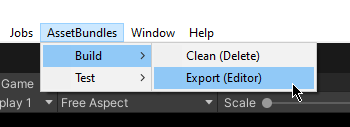
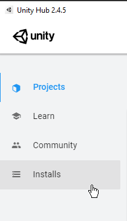
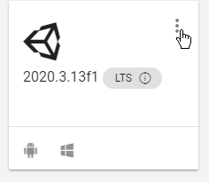
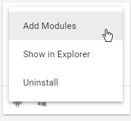

# Info
This is the asset bundle management we're using at Funktronic Labs. 
It's provided here as-is, with no support. 

## Asset Bundles

AssetBundles are not used by default in the Editor. You can force the editor to use them by changing `AssetBundleService.USE_ASSETDATABASE` to true. 
You can rebuild by clicking on `BuildSystem/Assetbundles/*` from the top toolbar in Unity. 



PS: AssetBundles are per-platform. For them to work in the Unity editor, it will try to also build Windows-specific AssetBundles. This means it will fail to build if you do not have the Windows IL2CPP module installed locally for Unity, even if you are not making Windows builds.

Here is how you can install it, if you do not have it already:







When making a build either from a build script or from the editor, it's setup so Unity will either ask you first or just build the asset bundles for you. This runs the whole process of tagging asset bundles for you and then builds them.

### Defining AssetBundles

When selecting any UnityEngine.Object in the project view, the top of the inspector will have a 'funky bundles' dropdown. You can select the bundle we want this asset to belong to. You can also use the browser per-bundle, in the bundles folder. look for `default.asset` - our default asset bundle.

### Using Assets inside of AssetBundles

Please use `AssetReference<T>` when making references to anything within these folders rather than using their path strings by hand. `AssetReference<T>` has a special property drawer that let's you just drag in the objects you want and it hanldes assigning assets to asset bundles automatically for you. You can then use them like this:

```cs
AssetReference<GameObject> myAssetReference; // reference from inspector or somewhere
yield return Services.assetBundles.LoadAsync(myAssetReference);
var myPrefab = Services.assetBundles.GetAsyncResult(myAssetReference);

var myGameobject = GameObject.Instantiate(myPrefab);
```